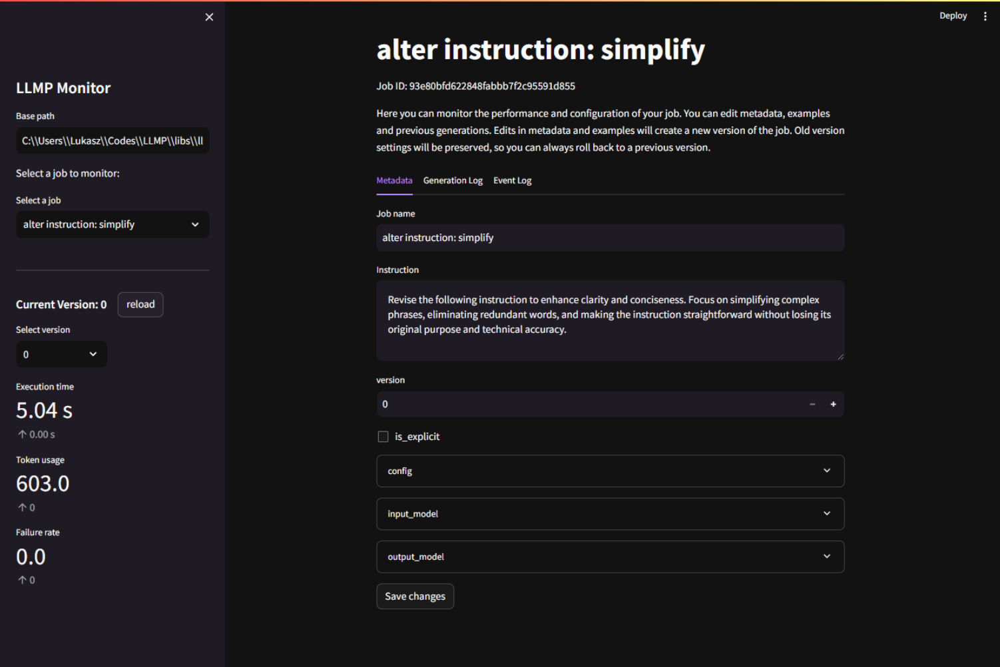

# Large Language Model Programming (LLMP)

LLMP provides a high-level abstraction for creating, storing, and optimizing generative NLP tasks. It leverages the power of large language models, enabling users to seamlessly integrate them into their software projects without the hassle of manually crafting and optimizing prompts.

## Key Features

- **Job Creation**: Define jobs using input and output object structures.
- **Auto-Optimization**: LLMP automatically optimizes prompts to achieve desired outputs.
- **Metrics Collection**: Evaluate the performance of prompts in terms of accuracy, efficiency, and cost.
- **Storage Management**: Jobs are organized and stored systematically for easy retrieval and management.


## Documentation and Examples

For detailed documentation and examples, please refer to the:
 - Full documentation: [project documentation](https://llmp.vercel.app/docs/intro).
 - API Reference: [API reference](https://llmp.readthedocs.io/en/latest/api_reference.html).
## Quick Start

### Installation
```bash
pip install pyllmp
```

### Creating a Job

```python
from pydantic import BaseModel
from typing import Literal
from llmp.services.program import Program

class InputObject(BaseModel):
    book_title: str
    book_author: str
    release_year: int

class OutputObject(BaseModel):
    genre: Literal["fiction", "non-fiction", "fantasy", "sci-fi", "romance", "thriller", "horror", "other"]

# Initialize a job
program = Program("Book to Genre", input_model=InputObject, output_model=OutputObject)
```

### Loading a Job

```python
program = Program("Book to Genre")
```

### Running a Job

After creating or loading a job, you can easily execute it with input data to get the desired output.

```python
input_data = {
    "book_title": "The Lord of the Rings",
    "book_author": "J. R. R. Tolkien",
    "release_year": 1954
}

result = program(input_data=input_data)
print(result)
```

**Output:**

```
{
    "genre": "fantasy"
}
```

### Monitoring a Job

To monitor existing jobs, you can use the `streamlit` command-line tool to run the monitoring application. Navigate to the `libs/llmp-monitor` directory and run the following command:

```bash
streamlit run app.py
```

Here you can past your local job directory path to monitor, update and optimize jobs located in that directory.
Once you have run the command and entered the path, you can access the monitoring application at `http://localhost:8501`.
You should see a screen similar to the following:





## Architecture

LLMP follows a component-based architecture with service layers, ensuring modularity and scalability. For detailed insights into the architecture, refer to the project documentation.

## Contribute

LLMP is an open-source project. Contributions, feedback, and suggestions are welcome! Please check out the `CONTRIBUTING.md` guide for more details.

## License

This project is licensed under the MIT License. See the `LICENSE` file for details.
